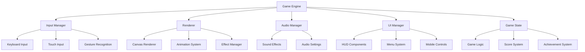

# 贪吃蛇游戏用户体验优化设计文档

## 概述

本设计文档详细描述了贪吃蛇游戏用户体验优化的技术实现方案。我们将在现有游戏基础上，通过模块化重构、添加新功能组件和优化渲染系统来实现全面的用户体验提升。

## 架构设计

### 核心架构原则

1. **模块化设计** - 将功能拆分为独立的模块，便于维护和扩展
2. **事件驱动** - 使用事件系统解耦各个组件之间的依赖
3. **响应式设计** - 支持多种设备和屏幕尺寸
4. **性能优化** - 使用requestAnimationFrame替代setInterval，优化渲染性能

### 整体架构图



## 组件和接口设计

### 1. 游戏引擎核心 (GameEngine)

```javascript
class GameEngine {
    constructor()
    init()
    start()
    pause()
    resume()
    stop()
    update(deltaTime)
    render()
}
```

**职责：**
- 管理游戏生命周期
- 协调各个子系统
- 处理游戏循环和时间管理

### 2. 输入管理器 (InputManager)

```javascript
class InputManager {
    constructor()
    addKeyboardListeners()
    addTouchListeners()
    handleSwipeGesture(direction)
    preventInvalidMoves(newDirection, currentDirection)
}
```

**职责：**
- 统一处理键盘和触摸输入
- 手势识别和方向控制
- 输入验证和防误操作

### 3. 渲染系统 (Renderer)

```javascript
class Renderer {
    constructor(canvas, context)
    clear()
    drawSnake(snake, animationProgress)
    drawFood(food, pulseAnimation)
    drawEffects(effects)
    drawUI(uiElements)
}
```

**职责：**
- Canvas渲染管理
- 动画插值计算
- 视觉效果渲染

### 4. 动画系统 (AnimationSystem)

```javascript
class AnimationSystem {
    constructor()
    createAnimation(type, duration, easing)
    updateAnimations(deltaTime)
    addEffect(effect)
    removeEffect(effectId)
}
```

**职责：**
- 管理所有动画效果
- 提供缓动函数
- 效果生命周期管理

### 5. 音频管理器 (AudioManager)

```javascript
class AudioManager {
    constructor()
    loadSounds()
    playSound(soundName)
    setVolume(volume)
    toggleMute()
}
```

**职责：**
- 音效播放和管理
- 音量控制
- 音频设置持久化

### 6. UI管理器 (UIManager)

```javascript
class UIManager {
    constructor()
    createMobileControls()
    showGameInstructions()
    updateScore(score)
    showPauseScreen()
    showGameOverScreen(stats)
}
```

**职责：**
- UI组件管理
- 移动端控制界面
- 游戏状态界面

## 数据模型

### 游戏状态模型

```javascript
const GameState = {
    status: 'menu|playing|paused|gameOver',
    score: 0,
    level: 1,
    speed: 100,
    snake: [{x, y}],
    food: {x, y, type},
    settings: {
        soundEnabled: true,
        volume: 0.7,
        difficulty: 'normal'
    },
    statistics: {
        gamesPlayed: 0,
        highScore: 0,
        totalScore: 0,
        achievements: []
    }
}
```

### 动画效果模型

```javascript
const Effect = {
    id: 'unique-id',
    type: 'fireworks|foodEaten|scorePopup',
    position: {x, y},
    duration: 1000,
    startTime: timestamp,
    properties: {
        color: '#ff0000',
        size: 10,
        opacity: 1
    }
}
```

### 成就系统模型

```javascript
const Achievement = {
    id: 'achievement-id',
    name: '成就名称',
    description: '成就描述',
    condition: {
        type: 'score|games|streak',
        value: 100
    },
    unlocked: false,
    unlockedAt: timestamp
}
```

## 错误处理

### 错误类型和处理策略

1. **输入错误**
   - 无效的方向输入 → 忽略并保持当前方向
   - 触摸事件冲突 → 使用防抖机制

2. **渲染错误**
   - Canvas上下文丢失 → 重新初始化渲染器
   - 动画性能问题 → 降级到简化动画

3. **音频错误**
   - 音频文件加载失败 → 静默运行，不影响游戏
   - 浏览器音频策略限制 → 提示用户交互后启用

4. **存储错误**
   - localStorage不可用 → 使用内存存储
   - 数据格式错误 → 重置为默认设置

### 错误恢复机制

```javascript
class ErrorHandler {
    static handleRenderError(error) {
        console.warn('Render error:', error);
        // 降级到基础渲染模式
    }
    
    static handleAudioError(error) {
        console.warn('Audio error:', error);
        // 禁用音效，继续游戏
    }
    
    static handleStorageError(error) {
        console.warn('Storage error:', error);
        // 使用默认设置
    }
}
```

## 测试策略

### 单元测试

1. **游戏逻辑测试**
   - 蛇的移动逻辑
   - 碰撞检测算法
   - 分数计算系统

2. **输入处理测试**
   - 键盘输入响应
   - 触摸手势识别
   - 输入验证逻辑

3. **动画系统测试**
   - 动画时间计算
   - 缓动函数正确性
   - 效果生命周期管理

### 集成测试

1. **跨组件交互测试**
   - 输入到游戏逻辑的数据流
   - 游戏状态到UI的更新
   - 音效触发时机

2. **设备兼容性测试**
   - 不同屏幕尺寸适配
   - 触摸设备响应性
   - 性能在低端设备上的表现

### 用户体验测试

1. **可用性测试**
   - 新用户学习曲线
   - 控制响应性
   - 视觉反馈清晰度

2. **性能测试**
   - 帧率稳定性
   - 内存使用情况
   - 长时间游戏稳定性

## 实现细节

### 移动端支持实现

1. **虚拟控制器**
   - 使用CSS Grid布局创建方向键
   - 触摸事件处理和视觉反馈
   - 自适应大小和位置

2. **手势识别**
   - 实现滑动手势检测
   - 设置最小滑动距离阈值
   - 防止误触和多点触控干扰

### 动画系统实现

1. **平滑移动动画**
   - 使用线性插值实现蛇身移动
   - 基于时间的动画而非帧数
   - 支持不同缓动函数

2. **视觉效果**
   - 粒子系统实现烟花效果
   - CSS动画结合Canvas渲染
   - 效果池管理避免频繁创建销毁

### 音频系统实现

1. **音效管理**
   - 预加载音频文件
   - 音频池复用避免延迟
   - 支持音量控制和静音

2. **浏览器兼容性**
   - 处理不同浏览器的音频API差异
   - 用户交互后启用音频
   - 优雅降级处理

### 性能优化

1. **渲染优化**
   - 使用requestAnimationFrame
   - 脏矩形更新减少重绘
   - 离屏Canvas预渲染静态元素

2. **内存管理**
   - 对象池管理游戏实体
   - 及时清理动画效果
   - 避免闭包内存泄漏

### 响应式设计

1. **布局适配**
   - CSS媒体查询适配不同屏幕
   - Canvas尺寸动态调整
   - UI元素比例缩放

2. **交互适配**
   - 触摸目标大小优化
   - 手势操作区域设计
   - 键盘和触摸的统一体验

## 技术选型

### 核心技术
- **HTML5 Canvas** - 游戏渲染
- **Web Audio API** - 音效处理
- **CSS3 Animations** - UI动画
- **Touch Events API** - 移动端支持
- **localStorage** - 数据持久化

### 开发工具
- **ES6+ JavaScript** - 现代语法特性
- **CSS Grid/Flexbox** - 响应式布局
- **Web APIs** - 浏览器原生功能

### 兼容性考虑
- 支持现代浏览器 (Chrome 60+, Firefox 55+, Safari 12+)
- 移动端浏览器优化
- 优雅降级处理旧版本浏览器